# 🌿 Farm Connect
### A Digital Ecosystem for Modern Agriculture

Farm Connect is a full-stack web platform designed to connect livestock owners (farmers) with suppliers of animal feed and veterinary medicines. It supports inventory discovery, livestock records, request/order workflows, feedback, and role-specific analytics.

> **Project documentation:** This README is based on the Farm Connect project report dated 04 May 2026 and the supplied application screenshots. Setup commands and environment variable names should be checked against the source code before deployment.

## Contents
- [Overview](#overview)
- [Key Features](#key-features)
- [Technology Stack](#technology-stack)
- [Application Screenshots](#application-screenshots)
- [Architecture](#architecture)
- [Project Structure](#project-structure)
- [API Overview](#api-overview)
- [Local Development](#local-development)
- [Environment Configuration](#environment-configuration)
- [Security Notes](#security-notes)
- [Testing](#testing)
- [Roadmap](#roadmap)

## Overview

Farm Connect addresses common agricultural procurement challenges such as fragmented supply chains, limited inventory visibility, manual request tracking, and scattered livestock health records. The application provides separate experiences for two roles:

- **Owner (Farmer):** maintains livestock records, browses feed and medicines, places requests, reviews request status, submits feedback, and views farm analytics.
- **Supplier:** manages feed and medicine listings, reviews and approves/rejects requests, and views sales and inventory analytics.

## Key Features

### Owner / Farmer
- Register, log in, log out, and recover an account using email OTP.
- Create, view, update, and delete livestock records, including health and vaccination details.
- Browse available feed and veterinary medicines.
- Place requests for feed or medicine linked to livestock.
- View request history and request status.
- Submit 1–5 star feedback on fulfilled requests.
- Review analytics such as spending trends, order counts, livestock health distribution, and commonly purchased products.

### Supplier
- Manage feed inventory, prices, and available quantities.
- Manage medicine listings and details such as dosage, manufacturer, stock, and expiry date.
- Review incoming owner requests and approve or reject them with optional comments.
- View supplier analytics including revenue, request conversion, monthly trends, top-selling products, buyer activity, and inventory health.

### Platform
- Role-based access control (Owner and Supplier).
- JWT-based authentication and protected API routes.
- Password hashing with bcryptjs.
- Image upload support using Multer.
- Analytics visualizations using Recharts.
- MongoDB document storage with Mongoose schema validation.

## Technology Stack

| Layer | Technologies listed in the project report |
|---|---|
| Frontend | React 18, Tailwind CSS, Redux Toolkit, React Router DOM, Material UI, Framer Motion, Axios, Recharts |
| Backend | Node.js, Express.js, Mongoose, JWT, bcryptjs, Nodemailer, Multer |
| Database | MongoDB |
| Testing | Jest, Supertest, React Testing Library, jsdom, axios-mock-adapter |

Version details recorded in the project report include React 18.2.0, Tailwind CSS 3.4.19, Redux Toolkit 1.9.7, React Router DOM 6.17.0, and Jest 29.7.0. Refer to the package manifests for the versions actually installed in this repository.

## Application Screenshots

Screenshots below are from the supplied project output archive. They demonstrate key screens and workflows.

### Landing page
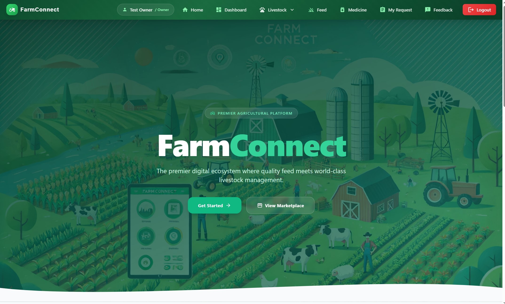

### Owner experience
| Owner analytics | Livestock inventory |
|---|---|
| 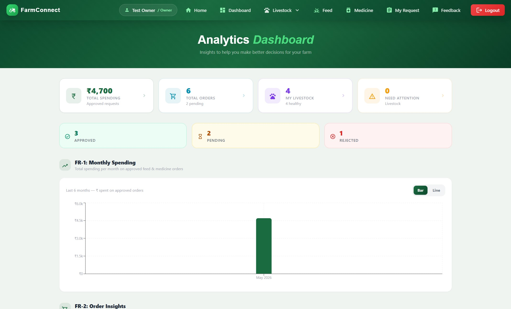 | 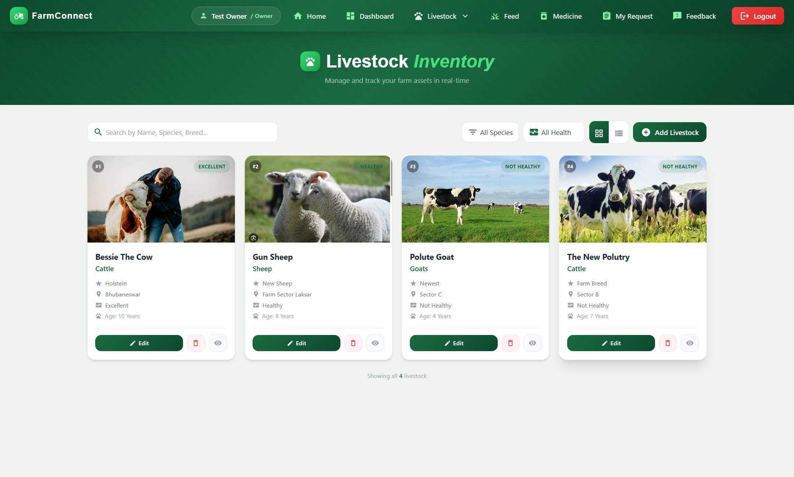 |

| Feed catalog | Medicine catalog |
|---|---|
| 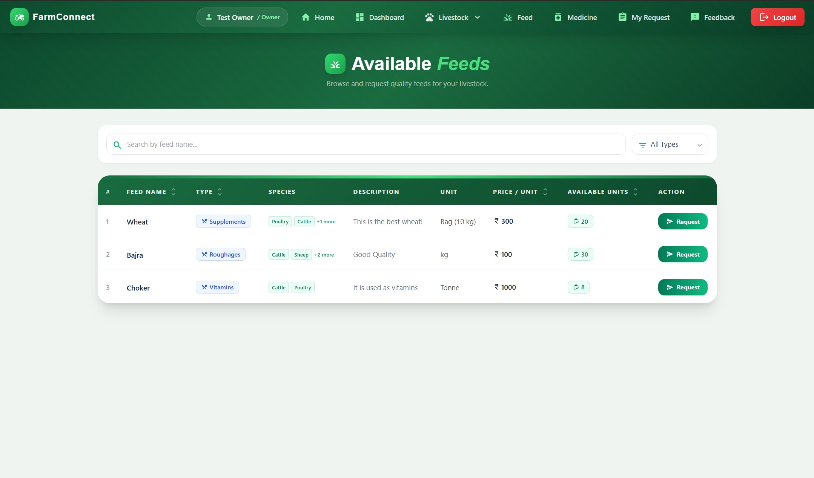 | 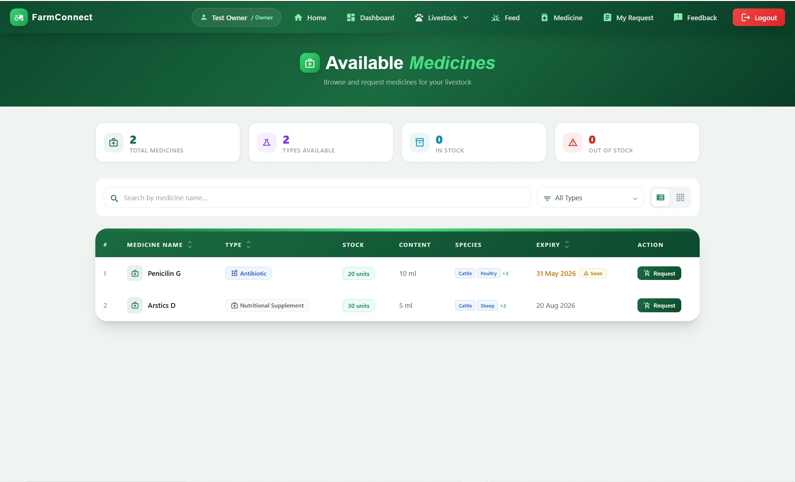 |

| My requests | My feedback |
|---|---|
| 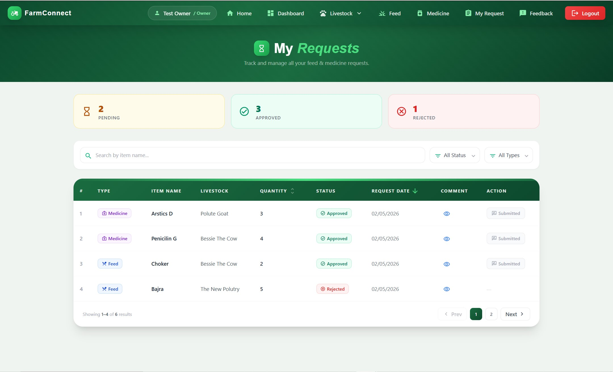 | 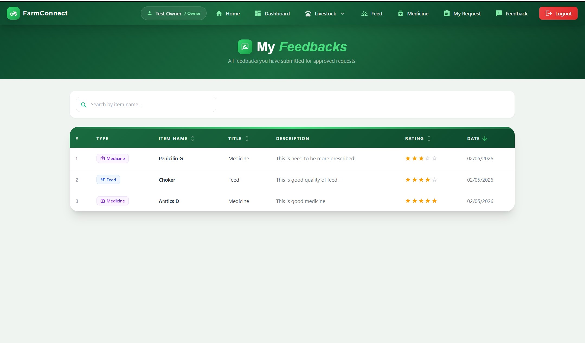 |

### Supplier experience
| Supplier analytics | Feed inventory |
|---|---|
| 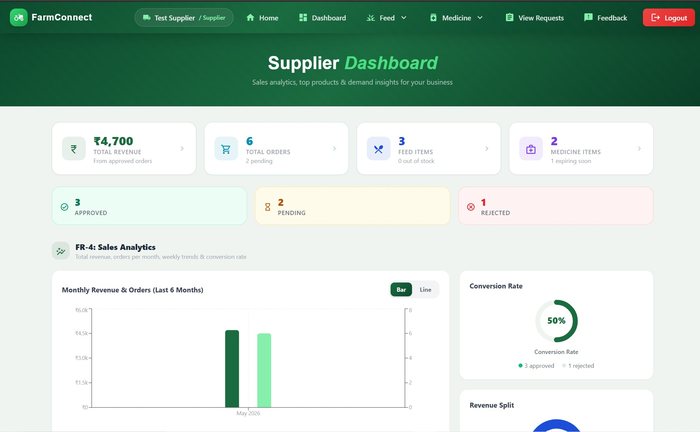 | 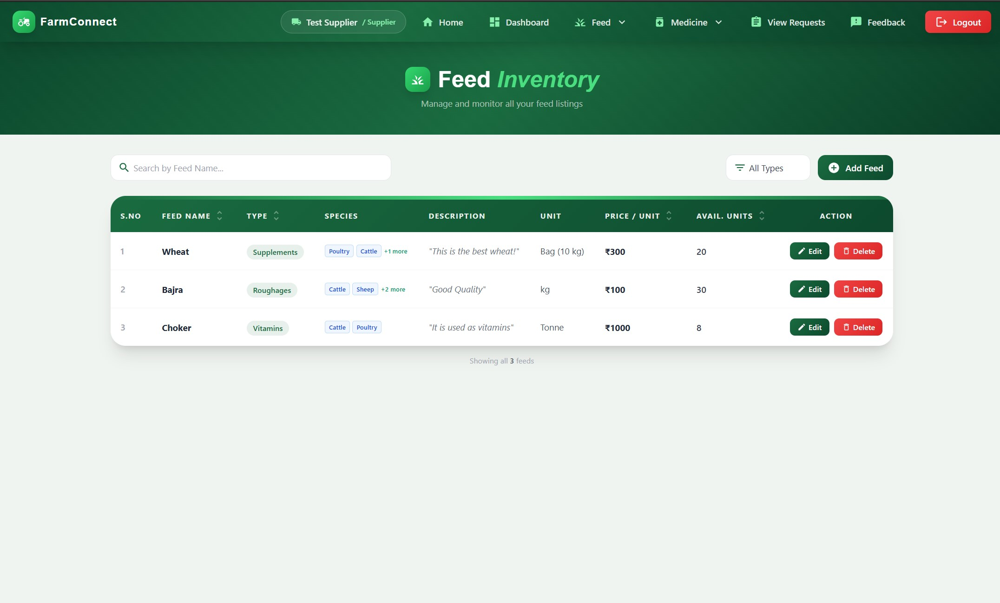 |

| Medicine inventory | Manage requests |
|---|---|
| 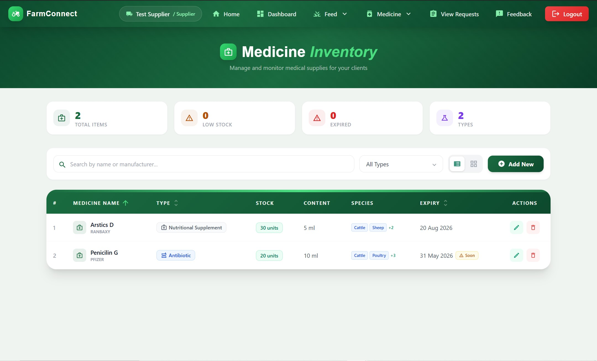 | 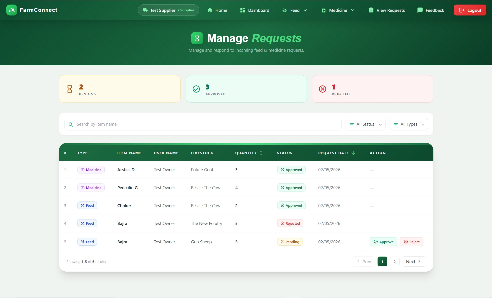 |

### Authentication
| Login | Create account | Forgot password |
|---|---|---|
| 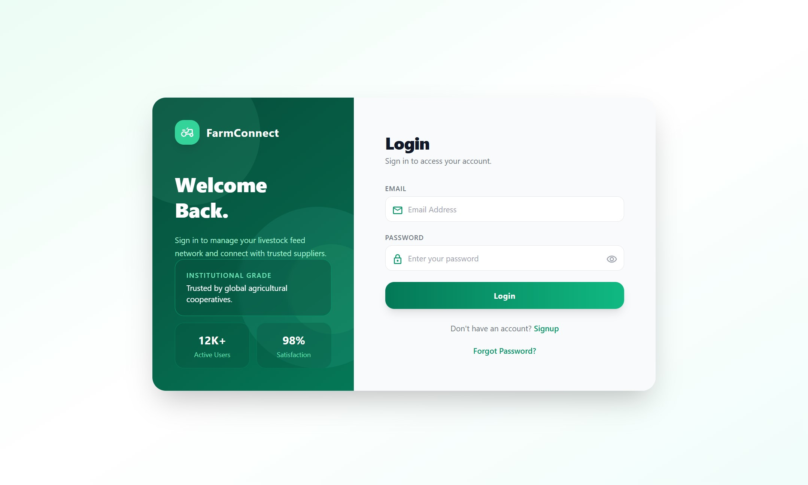 | 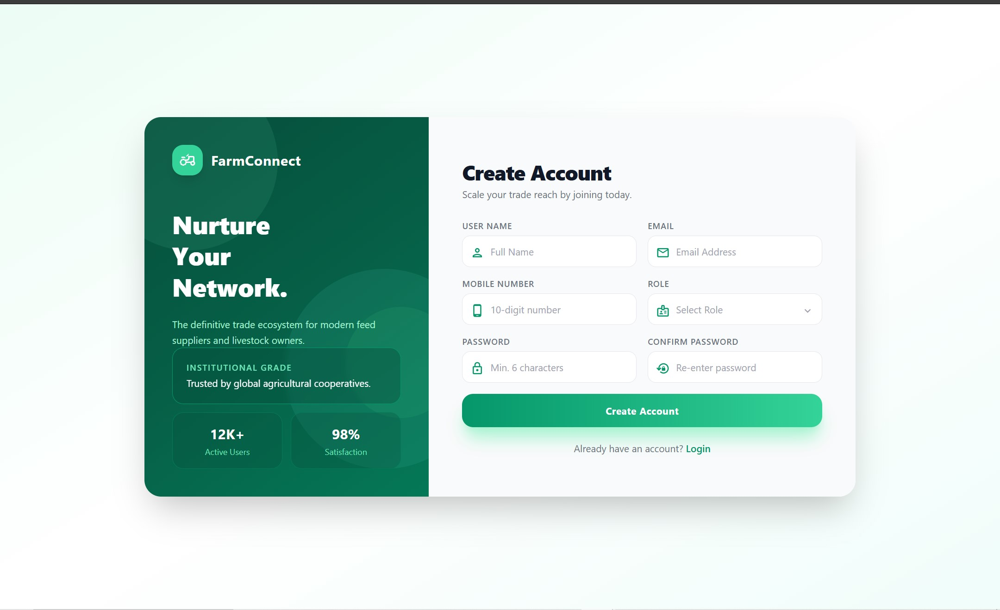 | 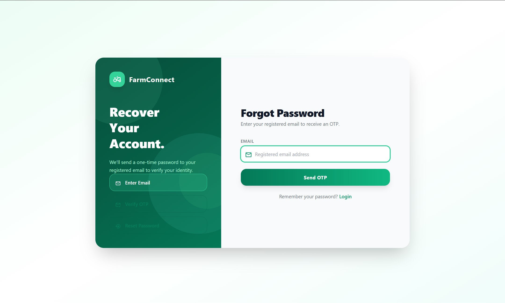 |

## Architecture

The project report describes a three-tier architecture:

1. **Presentation layer:** React single-page application, Redux Toolkit, React Router, styling libraries, charts, and Axios API calls.
2. **Business logic layer:** Node.js/Express REST API, authentication and role middleware, controllers, OTP email flow, and upload handling.
3. **Data layer:** MongoDB accessed through Mongoose models.

The frontend communicates with the backend through the REST API. The report lists the Express server port as **8080** and API routes under the `/api` prefix.

## Project Structure

The report describes the following high-level layout:

```text
Farm_Connect/
├── nodeapp/                 # Express REST API backend
│   ├── controllers/         # Business logic
│   ├── models/              # Mongoose schemas
│   ├── routers/             # Express routes
│   ├── middleware/          # Upload middleware
│   ├── authUtils.js         # JWT and role utilities
│   ├── otpUtils.js          # OTP utilities
│   └── index.js             # Server entry point
└── reactapp/                # React frontend
    ├── public/              # Static assets
    └── src/                 # Application source
```

> If the checked-out source tree differs from this report layout, use the actual folder names in the repository.

## API Overview

The project report documents API endpoints under `/api`:

| Area | Example endpoints | Purpose |
|---|---|---|
| Users | `POST /api/users/signup`, `POST /api/users/login`, `POST /api/users/logout` | Account and session management |
| Password recovery | `POST /api/users/forgot-password`, `POST /api/users/reset-password` | Email OTP password recovery |
| Livestock | `GET/POST /api/livestock`, `GET/PUT/DELETE /api/livestock/:id` | Livestock records |
| Feed | `GET/POST /api/feed`, `GET/PUT/DELETE /api/feed/:id` | Feed listings |
| Medicine | `GET/POST /api/medicine`, `GET/PUT/DELETE /api/medicine/:id` | Medicine listings |
| Requests | `GET /api/requests/owner`, `GET /api/requests/supplier`, `POST /api/requests/owner`, `PUT /api/requests/:id` | Request lifecycle |
| Analytics | `GET /api/analytics/owner`, `GET /api/analytics/supplier` | Role-specific analytics |

Protected endpoints require a valid JWT through the configured cookie or bearer-token mechanism. Check the backend route definitions for exact methods, middleware, and response formats.

## Local Development

The project report identifies `nodeapp` as the backend and `reactapp` as the frontend. Run commands from the corresponding folders and follow each folder's `package.json`.

### 1. Prerequisites
- Node.js and npm
- MongoDB (local instance or a configured hosted MongoDB database)
- Git

### 2. Backend
```bash
cd nodeapp
npm install
```

Create the backend environment file based on the configuration read by the backend source code, then start the server using the script defined in `nodeapp/package.json`. For example, inspect available scripts with:

```bash
npm run
```

### 3. Frontend
Open a second terminal:

```bash
cd reactapp
npm install
```

Inspect the available scripts:

```bash
npm run
```

Use the development script defined in `reactapp/package.json`. Configure the frontend API base URL according to the environment-variable convention actually used by the React app.

> The exact start scripts and frontend API variable are not specified in the supplied report, so they are intentionally not guessed here.

## Environment Configuration

The report explicitly names `JWT_SECRET` as the configurable JWT signing secret. Other required configuration depends on the source code. Before running or deploying, inspect the backend configuration and provide values through environment variables, for example:

```dotenv
JWT_SECRET=replace_with_a_long_random_secret
```

Set the MongoDB connection string and email/SMTP settings using the exact variable names expected by the code. **Do not commit real `.env` files, passwords, SMTP credentials, JWT secrets, API keys, or production connection strings.**

For Git, add environment files to `.gitignore`. If helpful, create a `.env.example` containing only placeholder values and variable names.

## Security Notes

The project report describes:
- JWT tokens with a 24-hour expiry and HttpOnly cookie storage.
- bcryptjs password hashing with 10 salt rounds.
- Role-based authorization middleware for Owner and Supplier routes.
- CORS configured for an authorized frontend origin.
- Time-limited OTP email password recovery.
- Mongoose validation and a unique email index.

Review the implementation and deployment configuration before treating these as production guarantees. Keep secrets outside source control and use HTTPS in deployed environments.

## Testing

The report describes Jest-based backend unit and integration tests, with Supertest for HTTP testing, and frontend component tests using React Testing Library and jsdom. It lists `npm test` for backend tests, but confirm the actual scripts in each package manifest before running:

```bash
cd nodeapp
npm test
```

## Roadmap

Enhancements listed in the report include:
- Real-time request notifications and mobile push notifications.
- Improved feed and medicine search/filtering.
- Bulk requests.
- Payment gateway integration (Razorpay/UPI).
- Veterinarian consultation booking.
- SMS OTP and multilingual support (Hindi, Telugu, Kannada).
- Progressive Web App support.
- AI-assisted livestock disease prediction.
- QR-based product traceability and broader agricultural marketplace capabilities.

## Project Status and Notes

This README summarizes the provided project report and screenshot archive. It does not independently verify deployment status, test results, or production readiness. Confirm configuration, dependencies, test scripts, and actual routes against the source repository before deploying.

---

**Farm Connect — Digital Agricultural Ecosystem**  
Project report date: 04 May 2026
